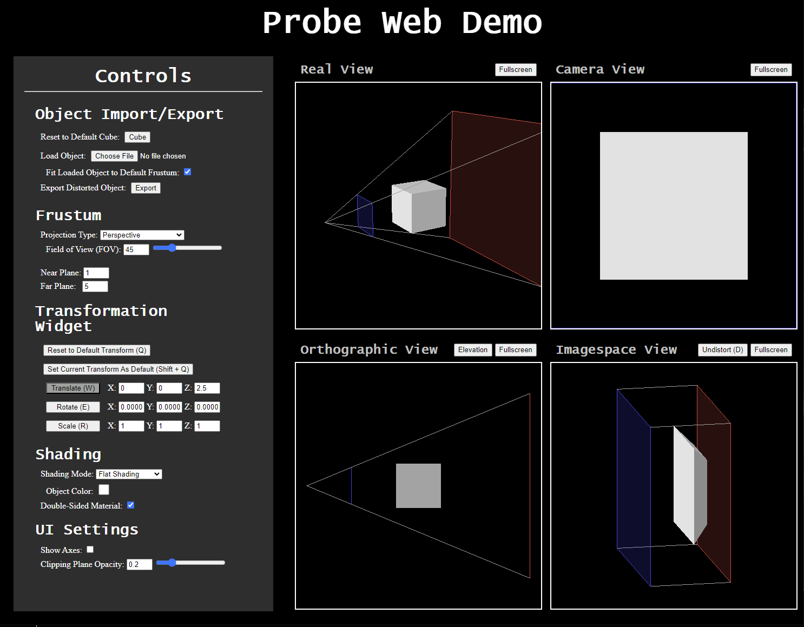
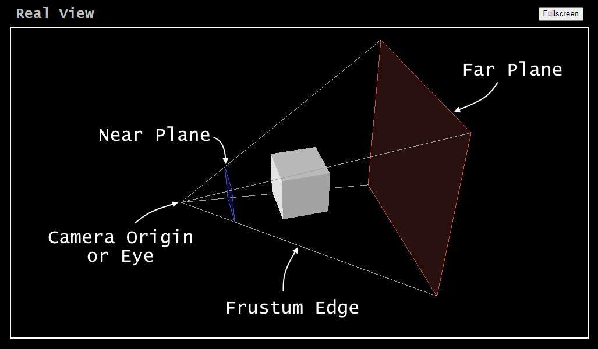
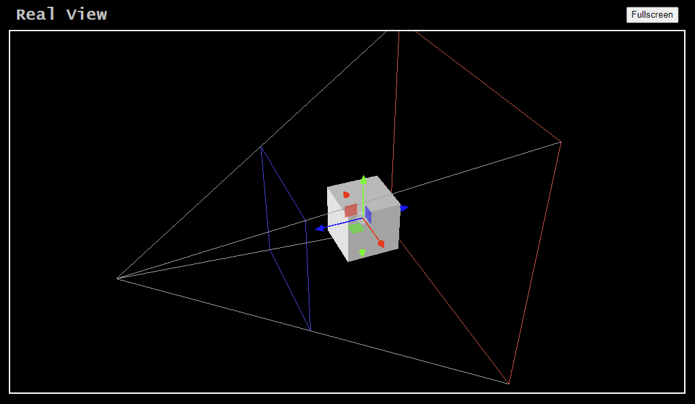
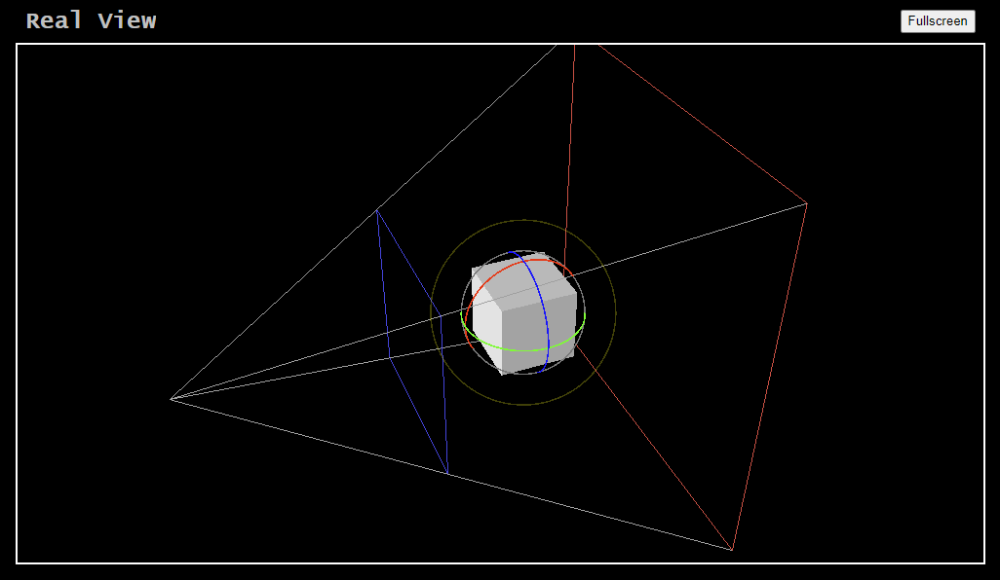
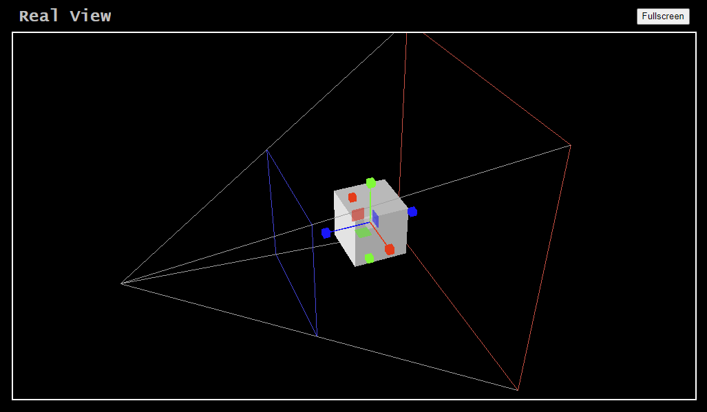

# Probe Web Demo

A web-based demo for visualizing perspective transformations developed by the Program of Computer Graphics at Cornell University for educational purposes.

 

  

## Prior Versions

This web application is a rebuild of Probe, a similar program developed in Java by the Program of Computer Graphics in the late 1990s and early-to-mid 2000s. The original Probe was used for , Probe 2.0 was developed by Alex Liberman in 2004, and Probe 2.1 was an improvement to Probe 2.0 made in the summer of 2007 by Konstantin Shkurko. 

While made to look similar to Probe 2.1, this web application is a complete rewrite of the software using three.js. It includes some features not present in the java-based application, removes other features that were not actively being used, and reworks some features to work with the capabilities of three.js and WebGL. 

 

## Browser Compatibility

This web application was built and tested using the browser Google Chrome. From our testing, it appears to function correctly for Microsoft Edge and Mozilla Firefox, but these have not been thoroughly tested. There are known issues on mobile using Safari. Additionally, we have found that, occasionally, the deployed version of the web application requires a few refreshes before it starts working properly.

 

## General Information

The interface for Probe (as displayed by the browser "Google Chrome") is shown at the top of this ReadMe. There are four viewports: **Real**, **Camera**, **Orthographic**, and **Imagespace**.

- **Real View:** This view shows the undistorted geometry and the camera's frustum. In this view, the scene is in the "Eye Coordinate Space," a coordinate space centered on the camera's origin with axes pointing in the principal directions of the camera:

  - X-Axis - Right
  - Y-Axis - Up
  - Z-Axis - Forward

   

  Note that this is different from the typical "View Space" or "Camera Space" from OpenGL/WebGL, which has the Z-Axis flipped so that it points backwards from the camera, not forwards. While backwards direction of the OpenGL Z-Axis is less intuitive, it results in a right-handed view/camera space that matches the right-handedness of the world coordinate space, whereas the forwards direction of the Z-axis of the "Eye Coordinate Space" results in a left-handed coordinate space.

- **Camera View** This view shows what a camera with the specified frustum would see. There is a yellow border within the view that shows the extents of the camera, and all geometry outside the camera bounds is clipped and not shown. 

- **Orthographic View** This view shows an orthographic projection of the undistorted geometry and the camera's frustum. It has two modes: **Elevation** and **Plan**. These modes are toggled with the leftmost button above the view. 

- **Imagespace View** This view shows the distorted geometry and camera frustum. The camera in this view is orthographic. Here, the frustum becomes a half-cube or hemi-cube with the ranges [-1,1] in X/Y and [0,1] in Z.

  Note that this is different from the NDC space of OpenGL/WebGL, which uses a full cube with X/Y/Z all having the range [-1,1].

 

The image below shows the camera frustum:

 

  

The **Camera Origin** is the location of the pinhole camera. The **Viewing Frustum** is the region of the scene which is seen by the camera. This frustum includes all the volume within the pyramid between the **Near Plane** and the **Far Plane**. 

The user can manipulate the viewports using left-click, middle-click/scroll, and right-click. 

- Left-clicking and dragging orbits around the scene
- Middle-clicking and dragging or scrolling with the scroll wheel dollies (zooms) into and out of the scene
- Right clicking and dragging pans around the scene

These controls are restricted depending on the viewport:

- **Real View:** All camera operations are allowed
- **Camera View:** None of the camera operations are allowed
- **Orthographic View:** Dollying and panning are allowed
- **Imagespace View:** All camera operations are allowed

 

## Controls

The "Controls" section contains most of the settings that can be adjusted in Probe. There are five submenus, each of which are described in more detail below.

### Object Import/Export

This menu contains buttons/settings for importing/exporting geometry. The following controls are available:

- **Reset to Default Cube** - This button allows the user to reset the geometry to the starting cube.

- **Load Object** - This file entry input allows the user to import geometry in either the OBJ or GLTF format.

  - **Fit Loaded Object to Default Frustum** - If checked, the object will be fit into the space available within the default frustum. If unchecked, the raw object vertices will be directly used.  

- **Export Distorted Object** - This button allows the user to download their distorted geometry as an OBJ file. 
 
  Note that the exported geometry is the same as shown in the imagespace viewport, so if the viewport has been set to undistorted, the geometry will also be undistorted. 

### Frustum

This menu contains settings for the camera frustum shown in the viewport that is used to distort the geometry. The following controls are available:

- **Projection Type** - This dropdown allows the user to switch between a perspective-projection camera and a parallel-projection (axonometric) camera.

  - **Field of View (FOV)** - This number entry/slider allows the user to specify the field of view (in degrees) of the perspective camera. The screen is assumed to be square, so this setting defines both the horizontal and vertical FOV of the camera. This setting is only available if the projection type is set to "Perspective".

  - **Frustum Side Length** - This number entry/slider allows the user to specify the size of the orthographic frustum. This setting is only available if the projection type is set to "Parallel (Axonometric)".

- **Near Plane** - This number entry allows the user to specify the distance of the near plane from the camera. For realistic results, the user should ensure the number is less than the far plane.

- **Far Plane** - This number entry allows the user to specify the distance of the far plane from the camera. For realistic results, the user should ensure the number is greater than the near plane.

### Transformation Widget

This menu contains buttons/settings for the transformation widget. To activate the transformation widget, left-click the object. This will bring up a set of transformation controls that are attached to the object. There are three modes for the tranformation widget:

- *Translation* 
     
    
         
    This mode allows the user to reposition the object in 3D space. The controls appear as a set of arrows and planes. Left-clicking an arrow control and dragging will restrict the motion of the object to the axis of the arrow. Left-clicking a plane control and dragging will restrict the motion of the object to the plane. Left-clicking the center of the geometry and dragging will move the object without any constraints. This mode can be activated by clicking the "Translate" button or by pressing the 'W' key.
      

- *Rotation*
     
    
       
    This mode allows the user to rotate the object in 3D space. The controls appear as a set of circles which surround the object. Left-clicking a circle and dragging will rotate the object about the axis that is perpendicular to the circle. Holding 'Shift' while rotating will snap the object to the nearest 15-degree value. This mode can be activated by clicking the "Rotate" button or by pressing the 'E' key.
      

- *Scale* 
     
    
       
    This mode allows the user to scale the object in 3D space. The controls appear as a set of "box arrows" (lines with boxes at the ends) and planes. Left-clicking a box arrow control and dragging will scale the object along the axis of the arrow. Left-clicking a plane control and dragging will scale the object along the axes of the plane. Left-clicking the center of the geometry and dragging will scale the object uniformly in all directions. This mode can be activated by clicking the "Scale" button or by pressing the 'R' key.
      

The user can also specify exact values for the translation/rotation/scale of the object in the number entries if desired. These entries will also automatically be updated when using the transformation widget. Note that the rotation entries should be specified in degrees, not radians.  

If the user wishes to return the object to the default transformation, which is initially set to be the object's starting transformation, the user can either click the "Reset to Default Transform" button or press the 'Q' key. If the user wishes to set the object's current transformation as the default, the user can either click the "Set Current Transform as Default" button or press 'Shift + Q'.

The near and far planes can also be moved using the transformation widget. Left-clicking on either of the planes will activate the transformation widget, but it will always be in translate mode, and it will only have the Z-axis arrow available. Moreover, the near plane will not further than the far plane, and the far plane will not move closer than the near plane. 

### Shading

This menu contains buttons/settings for adjusting the shading of the object. The following controls are available:

- **Shading Mode** - This dropdown controls the type of shading applied to the object. There are four options:

    - *Wireframe* - Draws only the edges of the geometry.
    - *Flat Shading* - Draws the triangles of the geometry using the face-normals, resulting in a faceted look. 
    - *Smooth Shading* - Draws the triangles of the geometry using imported normals if they are available, resulting in a smoother look (depending on the data of the imported object, this may not behave as expected for the imagespace object or both the real object and imagespace objects).
    - *Normal Shading* - Draws the triangles of the geometry colored based on their normals. Note that for the imagespace object, the normals of the *distorted* geometry are used for shading, not the original geometry.

     

- **Generate De-Triangulated Wireframe** - When the user clicks this button, the app computes a simplified wireframe for the object by removing edges for which all attached faces have the same or nearly the same normal. This is espcially useful for viewing the one-point, two-point, and three-point perspective wireframes of the starting cube. This setting is only visible when the wireframe shading mode is selected.

    - **Use De-Triangulated Wireframe** - This checkbox allows the user to switch between the original wireframe of the imported object and the de-triangulated wireframe. 

     

- **Object Color** - This color picker entry allows the user to customize the color of the object for the wireframe, flat shading, and smooth shading options. The color picker is hidden when the normal shading mode is selected.

- **Double-Sided Material** - This checkbox allows the user to switch between double-sided shading and front-side only shading. Double-sided shading (checked) will draw faces even when viewed from the backside, and will use the backward-facing normal, whereas front-side only shading (unchecked) will only draw faces from the front. To see the difference, move the object to the edge of the frustum so that it is clipped, and position the camera so that it looks inside the object. 

### UI Settings

This menu contains settings for the user interface. The following controls are available:

- **Show Axes** - This checkbox allows the user to enable/disable a visual indicator for the origin/axes of the coordinate space. If checked, the axes are shown. Otherwise, they are hidden.

- **Clipping Plane Opacity** - This number entry/slider allows the user to specify the opacity for the near and far planes. By default, they are given a small opacity to make it easier for the user to identify them, but they can either be made fully transparent or fully opqaue if desired. 

 

## View Buttons

There are a number of buttons above the various views of the web application, each of which is described below:

- **Fullscreen** - There is one fullscreen button for each of the four views. Each one sets the corresponding view to fullscreen. Once the view is fullscreen, the button text changes to **Back to Four Views**, and clicking the button will restore the scene to the four view mode. 

- **Elevation/Plan** - This button is above the orthographic view. It allows the user to switch between an elevation view and a plan view of the frustum. Note that the text of the button is the *current* view, NOT the view that will be switched to when the button is pressed. 

- **Undistort/Distort** - This button is above the imagespace view. It allows the user to switch between an undistorted view frustum and a distorted view frustum (the text switches to "Distort" when clicked, and back to "Undistort" when clicked again). This switch is not instantaneous, and instead plays out as an animation. The view can also be distorted/undistorted by pressing the 'D' key.

## Keyboard Inputs

The following is a list of key inputs and their functionality in the web app:

- *W* - Activates translation mode for the transformation widget
- *E* - Activates rotation mode for the transformation widget
    - *Shift* - Hold while rotating to enable 15 degree angle snapping 
- *R* - Activates scaling mode for the transformation widget
- *Q* - Resets the object to its default transformation
    - *Shift + Q* - Sets the object's current transformation as its default transformation
- *D* - Distorts or undistorts the imagespace view
- *C* - Centers the current view on the center of the frustum (Note: this function centers the Imagespace View on the *distorted* frustum's center, even if the view is set to undistorted)
- *M* - Toggles on/off the "true" distortion animation (the default animation maintains the near plane size/position, the "true" animation moves/scales the near plane based on its actual position/scale)

## Class Demonstration Recommendations

The default settings for the web application are slightly different than the settings recommended for demonstration purposes, as we anticipated potential use of the software for a "distorted geometry project." Thus, if using this software for a class demonstration, we recommend the following steps for set up:

1) Load the webpage. Refresh the page if the application does not show the geometry.

2) Undistort the imagespace, and reposition the camera such that the distorting/undistorting animation looks reasonable.

3) Switch the shading mode to "Wireframe" and generate the de-triangulated wireframe for the base cube. Then, switch to whatever shading mode is preferred for starting the demonstration.